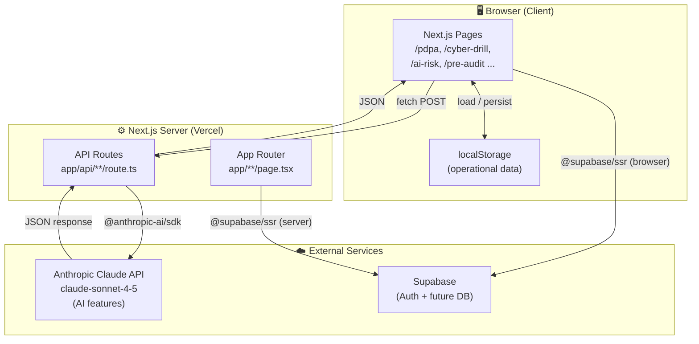
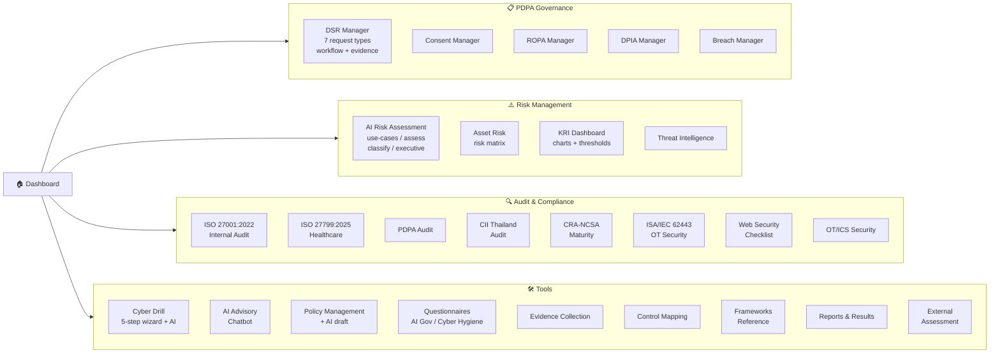
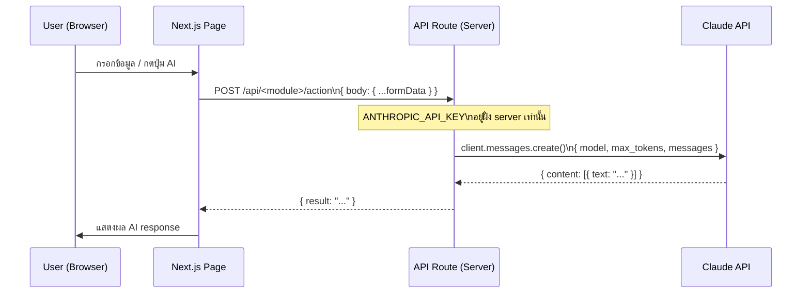
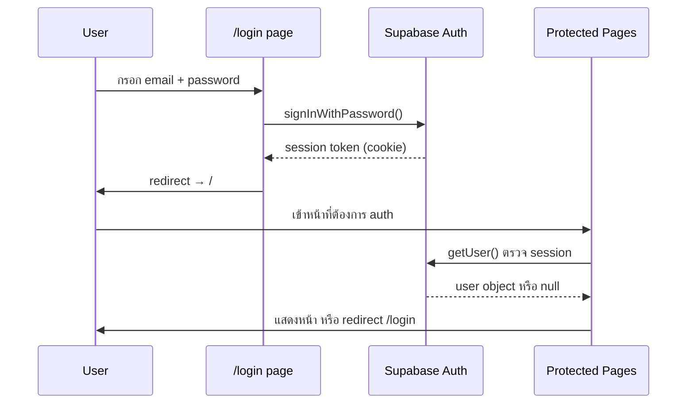
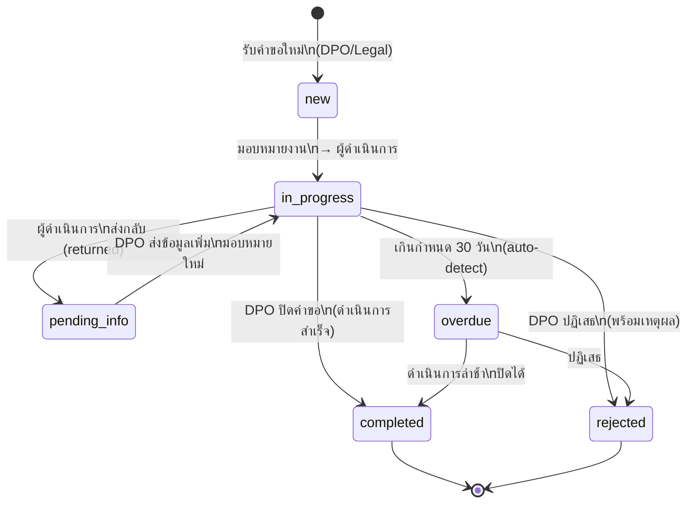
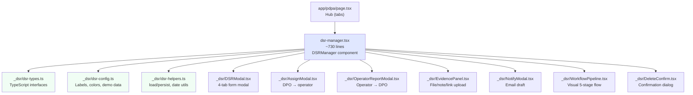
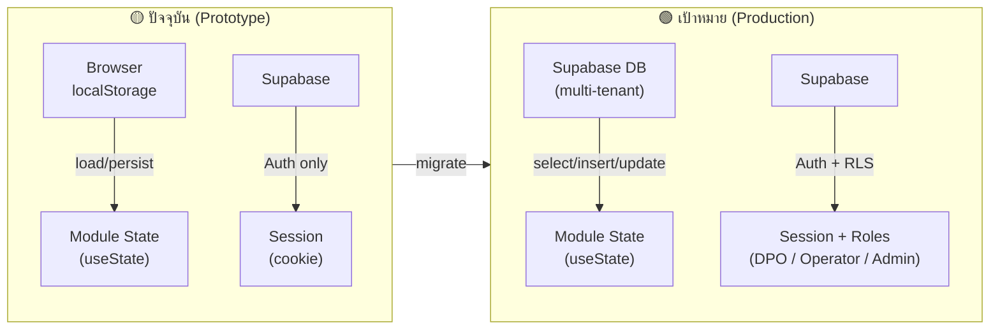

# Architecture Diagrams — AI GRC Platform

---

## 1. System Overview

---

## 2. Module Map

---

## 3. Data Flow — API Call (AI Feature)

---

## 4. Data Flow — Authentication

---

## 5. DSR Workflow (โมดูลที่ซับซ้อนที่สุด)

---

## 6. File Architecture — DSR Module (ตัวอย่าง Pattern ที่ถูก)

---

## 7. Storage Strategy (ปัจจุบัน vs เป้าหมาย)

